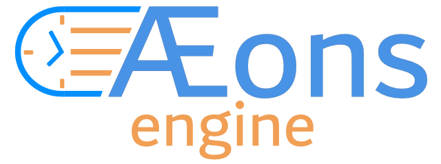

## This game engine is in active development and not ready for use yet.
 
 

## About this engine
Aeons is a game engine built using the [haxe](https://haxe.org) programming language.
The underlying framework is [Kha](https://github.com/Kode/Kha).

I combined all the parts that I liked from game engines I used over the years.

It tries to give you options on how to create your game. You can choose to use or ignore them.

You can use the built-in ECS or just loop over entities yourself or both.

Entities can have components that are just data or you can put all functionality in them if you don't want to make a system for it.

A Scene has an update and render function. So do entities. Components can have them and systems as well. This way you have choose for yourself how to use them.

The built-in components and systems use ECS for the most part, but components have functions when I think it is easier that way.
 
 

## Installation
To install Aeons open a terminal and run:
`haxelib git https://github.com/codescapade/aeons`  

After the installation run `haxelib run aeons setup` to download Kha and setup the 'aeons' command.
 
 

## Commands
- `aeons help` - Shows the list of available commands.
- `aeons setup` - Run the aeons setup process.
- `aeons create [project name]` - Create a project in the current directory using the starter template.
- `aeons atlas` Inside an Aeons project it will generate the sprite atlas from the `atlas.json` config.
- `aeons build [platform]` - Inside an Aeons project it will build the project for the chosen platform.  
for example `aeons build html5` or `eaons build windows`  
For available platforms see [Kha](https://github.com/Kode/Kha)
 
 

## Visual studio code extension
When writing code in visual studio code you can use the [Kha Extionsion Pack](https://marketplace.visualstudio.com/items?itemName=kodetech.kha-extension-pack) to get auto completion and debugging support.
 
 

## Running unit tests
To run the unit tests, Aeons expects that buddy is installed with haxelib.
